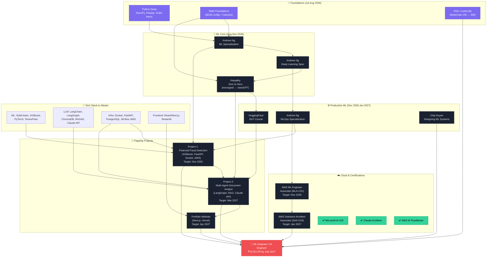

```mermaid
graph TD
    %% ===== GOAL =====
    GOAL["🎯 ML Engineer / AI Engineer<br/>₹15-30 LPA by July 2027"]

    %% ===== FOUNDATIONS =====
    subgraph FOUNDATIONS["📐 Foundations (Jul-Aug 2026)"]
        PYTHON["Python Deep<br/>(NumPy, Pandas, Scikit-learn)"]
        MATH["Math Foundations<br/>(3B1B LinAlg + Calculus)"]
        DSA["DSA / LeetCode<br/>(NeetCode 150 → 300)"]
    end

    %% ===== ML CORE =====
    subgraph ML_CORE["🧠 ML Core (Aug-Nov 2026)"]
        ANDREW_ML["Andrew Ng<br/>ML Specialization"]
        ANDREW_DL["Andrew Ng<br/>Deep Learning Spec"]
        KARPATHY["Karpathy<br/>Zero to Hero<br/>(micrograd → nanoGPT)"]
    end

    %% ===== MLOPS + LLM =====
    subgraph ADVANCED["⚙️ Production ML (Dec 2026-Jan 2027)"]
        MLOPS["Andrew Ng<br/>MLOps Specialization"]
        HF_NLP["HuggingFace<br/>NLP Course"]
        CHIP["Chip Huyen<br/>Designing ML Systems"]
    end

    %% ===== CLOUD + CERTS =====
    subgraph CERTS["☁️ Cloud & Certifications"]
        AWS_ML["AWS ML Engineer<br/>Associate (MLA-C01)<br/>Target: Nov 2026"]
        AWS_SAA["AWS Solutions Architect<br/>Associate (SAA-C03)<br/>Target: Jan 2027"]
        AI102["✅ Microsoft AI-102"]
        CLAUDE_CERT["✅ Claude Architect"]
        AWS_AIP["✅ AWS AI Practitioner"]
    end

    %% ===== PROJECTS =====
    subgraph PROJECTS["🚀 Flagship Projects"]
        P1["Project 1:<br/>Financial Fraud Detection<br/>(XGBoost, FastAPI, Docker, AWS)<br/>Target: Nov 2026"]
        P2["Project 2:<br/>Multi-Agent Document Analyst<br/>(LangGraph, RAG, Claude API)<br/>Target: Mar 2027"]
        PORTFOLIO["Portfolio Website<br/>(Next.js, Vercel)<br/>Target: Apr 2027"]
    end

    %% ===== TECH STACKS =====
    subgraph TECH["🔧 Tech Stack to Master"]
        ML_STACK["ML: Scikit-learn, XGBoost,<br/>PyTorch, TensorFlow"]
        LLM_STACK["LLM: LangChain, LangGraph,<br/>ChromaDB, RAGAS, Claude API"]
        INFRA_STACK["Infra: Docker, FastAPI,<br/>PostgreSQL, MLflow, AWS"]
        FRONTEND["Frontend: React/Next.js,<br/>Streamlit"]
    end

    %% ===== CONNECTIONS =====
    PYTHON --> ANDREW_ML
    MATH --> ANDREW_ML
    MATH --> KARPATHY
    DSA --> GOAL

    ANDREW_ML --> ANDREW_DL
    ANDREW_DL --> KARPATHY
    ANDREW_DL --> MLOPS
    KARPATHY --> HF_NLP

    MLOPS --> P1
    ANDREW_ML --> P1
    ML_STACK --> P1

    HF_NLP --> P2
    KARPATHY --> P2
    LLM_STACK --> P2
    P1 --> P2

    P2 --> PORTFOLIO
    PORTFOLIO --> GOAL

    MLOPS --> AWS_ML
    AWS_ML --> AWS_SAA
    AWS_SAA --> GOAL

    INFRA_STACK --> P1
    INFRA_STACK --> P2
    FRONTEND --> PORTFOLIO

    P1 --> GOAL
    P2 --> GOAL
    CHIP --> GOAL

    %% ===== STYLING =====
    classDef done fill:#34D399,stroke:#059669,color:#000
    classDef active fill:#7C6BF0,stroke:#5B4BD4,color:#fff
    classDef upcoming fill:#1A2130,stroke:#2A3346,color:#E7EAF0
    classDef goal fill:#EF4E52,stroke:#DC2626,color:#fff

    class AI102,CLAUDE_CERT,AWS_AIP done
    class PYTHON,MATH,DSA active
    class ANDREW_ML,ANDREW_DL,KARPATHY,MLOPS,HF_NLP,CHIP,AWS_ML,AWS_SAA,P1,P2,PORTFOLIO upcoming
    class GOAL goal
```
